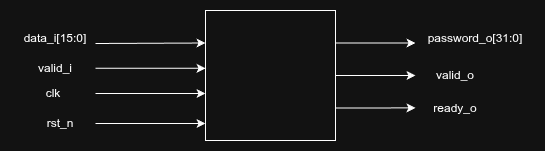
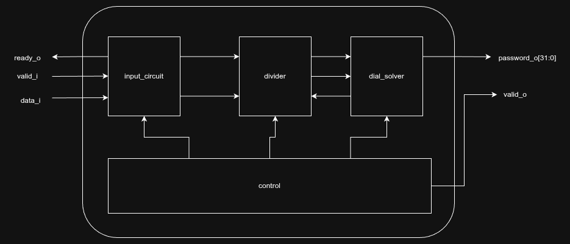

This is a solution to day 1 part 2 only.

# Algorithm
There are two options on how to solve this problem. The first is
accumulate the dial value with each turn, then perform integer division
and calculate the modulo by 100. We then perform a few checks to cover edge cases.
A turn is added to the dial for a right turn and subtracted for a left one.
The pseudocode is as follows:

```
for each turn:
    if right:
        curr_dial += val;
        password += curr_dial / 100;
        curr_dial = curr_dial % 100;
    else:
        int old_dial = curr_dial;
        curr_dial -= val;
        password += abs(curr_dial / 100);
        curr_dial = curr_dial % 100;
        if (curr_dial < 0):
            curr_dial += 100;
            if(old_dial != 0)
                password++;
        else if (curr_dial == 0):
            if(old_dial != 0)
                password++;
```

The issue with this algorithm is the dependency on
curr_dial, which makes pipelining difficult without frequent stalls. 
To decouple the division from the dial value, the algorithm was modified:

```
for each turn:
    // 1st stage
    password += val / 100;
    val %= 100;

    // 2nd stage
    int old_dial = curr_dial;
    curr_dial += (str[0] == 'R') ? val : -val;

    if right:
        if (curr_dial > 99):
            password++;
            curr_dial -= 100;
    else:
        if (curr_dial < 0):
            curr_dial += 100;
            if(old_dial != 0)
                password++;
        else if (curr_dial == 0):
            if(old_dial != 0)
                password++;
```

Unfortunately, in order to calculate the current dial we need to have the previous dial value, thus there is still a dependency, so the pipeline will still stall (assuming that there is a continuous stream of turns), but it is better than before. More on that later.

# Hardware
## Overview
The hardware uses a simple ready-valid handshake for its input, and a single valid signal for the output.
The input data is 16 bit and the output(password) is 32 bits.



After initialization, the number of turns must be provided before the first actual turn. A turn is a 16-bit signal encoded as follows:

```
L or R| value
1 bit | 15 bits
```

The msb is 0 or 1 depending on the type of the turn while the rest of bits are the actual value.

## Architecture
The pipeline consists of three main parts: the Input Circuit, the Divider, and the Dial Solver.



1. Input Circuit: Registers input data and handles backpressure. Its output(the turn) is fed to the divider.

2. The divider calculates the division and the modulo:
   ```
   password += val / 100;
   val %= 100;
   ```

   Noting that the divider is a constant (100) we can essentially calculate both by doing a multiplication and a few addition/subtractions. More details about this algorithm can be found [here][div_ref]. I used the library to generate a divider for 16-bit, got the magic number and S, and then performed the operations in function libdivide_u16_do. Disclaimer: I was going to use a regular divider, but after consulting the AI, I found this algorithm.

   The outputs of the divider are the quotient (the number of full turns) and the remainder (the remaining number of turns), which are fed to the dial_solver.

3. The dial solver performs this part of the algorithm in 2 clock cycles. It is a simple FSM:

   ```
       int old_dial = curr_dial;
       curr_dial += (str[0] == 'R') ? val : -val;
   
       if right:
           if (curr_dial > 99):
               password++;
               curr_dial -= 100;
       else:
           if (curr_dial < 0):
               curr_dial += 100;
               if(old_dial != 0)
                   password++;
           else if (curr_dial == 0):
               if(old_dial != 0)
                   password++;
   ```

The control "module" controls the pipeline and is also responsible for the
valid_o signal. It really is not worth going into details.

Note: Ideally, the divider would be pipelined with a 2-cycle latency to match the 2-cycle throughput of the dial_solver. This creates a balanced pipeline for intermittent turns, though a continuous stream is still limited by the dependency on the previous dial value.

## Simulation
Unfortunately I can't provide my inputs. To run use

```
make solve file_path=filePath
```

where filePath is the path to the inputs file(use absolute just to be sure). It will print the password once it's done.
You will need xvlog, xelab and xsim in $PATH.

Disclaimer: The script files(makefile and the 2 tcl scripts) were fully AI generated.

[div_ref]: https://github.com/ridiculousfish/libdivide
