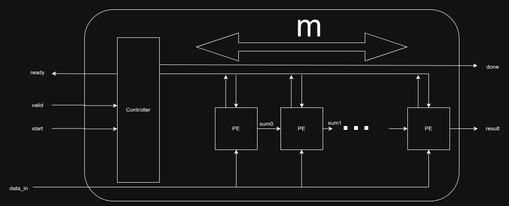
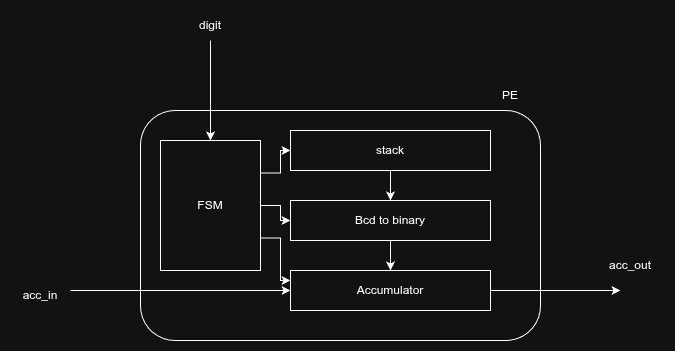
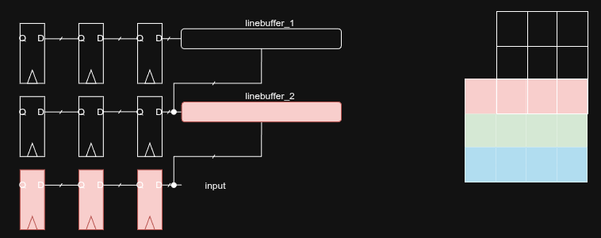
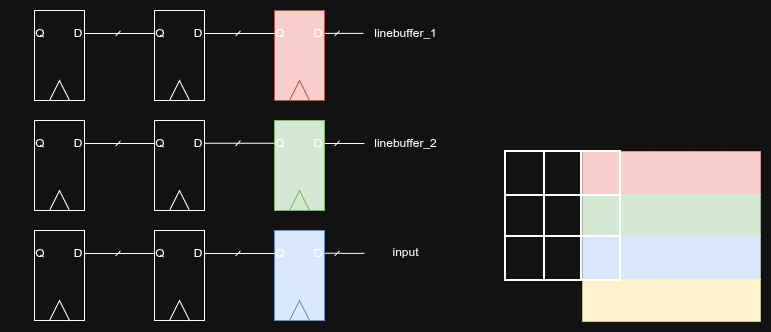
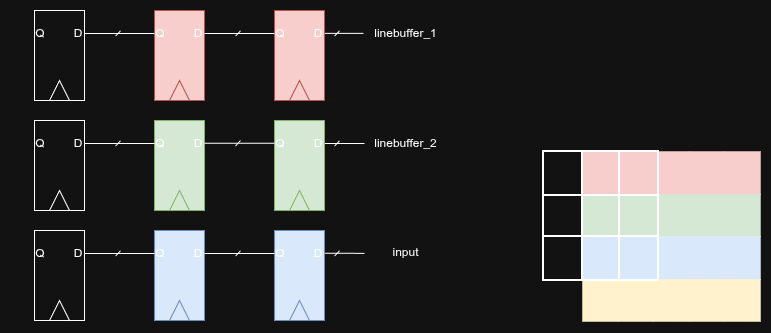
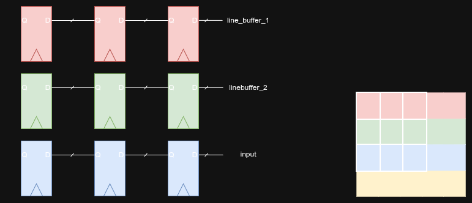
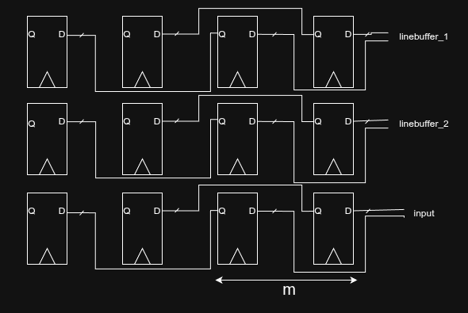
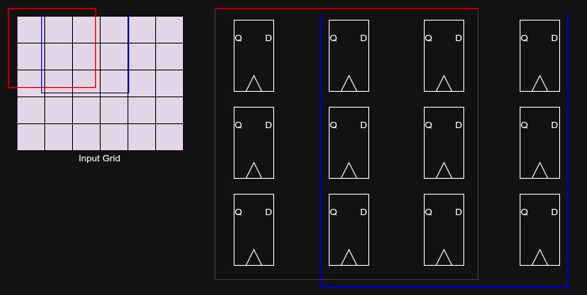
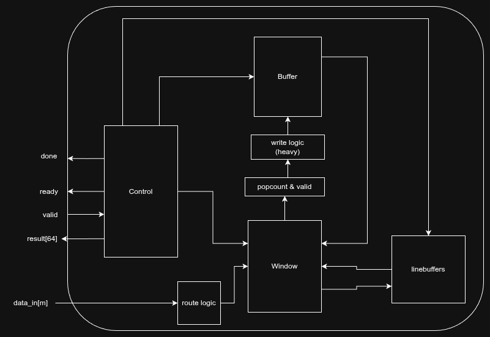

# Hardcaml
Comment: I solved Part 2 of Days 3 and 4 in Hardcaml. I needed to rely heavily on AI, due to my inexperience with ocaml and functional
programming in general. Although I've found the syntax, especially regarding iterating through lists/arrays, quite tedious, I have come
to appreciate the convenience that Verilog lacks. I particularly enjoyed the ease of managing signal widths automatically,
and the compiler errors for mismatches. In SystemVerilog, I often forgot to declare a signal, which would then be automatically inferred as 1-bit instead of triggering an error.

# Day 3
## Algorithm
The algorithm used is some variant of the monotonic stack. It solves this problem (for one row) in `O(n)` time and `O(k)` space, where k is
the number of selected digits and n is the total number of digits. It works as follows:
We maintain a stack of size k, and iterate through the digits. We compare each digit with the one on the top of the stack. If the new digit
is larger and we have the budget(remove_num), we pop digits from the stack until either the budget is exhausted or
top of the stack is larger than the current digit. Then, if the stack isn't full, we push the digit. The budget refers to the number of digits that we can safely discard while still being able to form a k-digit number, initially, it's equal to `n - k`. Essentially we try to shift the largest digit as far "left" as possible.
The pseudocode:

```
acc = 0
for each row:
    for each digit:
        while remove_num > 0 and top_stack < digit:
            stack.pop()
            remove_num -= 1

        if len(stack) < k:
            stack.append(digit)
        else:
            remove_num -= 1
    acc += stack
```

## Hardware
Given the algorithm, it is fairly trivial to parallelize the row processing. I chose to parallelize the outer for loop:

```
spatial for each m:
    for each row/m:
        for each digit:
```

Where m is the number of rows processed in parallel. For simplicity, we assume the total number of rows is perfectly divisible by m.

### Overview
The architecture follows a "systolic array-like" structure with one row of m PEs and a central controller. The circuit uses a simple ready-valid interface. Input data is 4*m bits wide, digits are provided in BCD format (4 bits per digit). The input is sliced into 4-bit chunks and distributed to the PEs, with each PE receiving one digit.



Each PE is responsible for processing a subset of rows (rows / m). Internally, the PE executes the nested loops: it processes a row digit-by-digit to form the k-digit number, converts it from BCD to binary, and accumulates it into a local 64-bit register. It then repeats this for the next assigned row.

To calculate the final result, the partial sums stored in each PE must be aggregated. This is done by shifting the sums horizontally through the chain and accumulating them in the rightmost PE. After m−1 cycles of shifting, the final result is available at the output.



## Simulation
To run edit the `tests/day_3_top.ml`, provide the filepath for the input file, adjust the parameters(`m`, `select_digits`, `num_digits`, `num_lines`) accordingly, and run

```
dune build @runtest
```

## Metrics
Some indicative values for different m:

```
| m  | Clock Cycles |
|:---|:-------------|
| 1  | 82214        |
| 2  | 50186        |
| 4  | 31034        |
| 5  | 26536        |
| 8  | 18837        |
| 10 | 15907        |
```
The clock cycles do not decrease strictly linearly with m for two reasons:

1. Naive Data Distribution: Input data is only consumed when all PEs are ready to accept a new digit.
2. Synchronization Barriers: Before the final horizontal shift can begin, the system must wait for the slowest PE to finish all of its assigned rows.

# Day 4
## Algorithm
This problem is basically a convolution-like operation with a `3×3` kernel, where at each position we count the rolls surrounding the roll at the center. If the neighbor count is less than 4, then we move the center roll. We iterate until no more rolls can be moved.

```
while (found):
   total_liftable = 0
   found = false
   for r in range(rows):
       for c in range(cols):
           if grid[r][c] == '@':
               neighbors = 0
   
               for dr in [-1, 0, 1]:
                   for dc in [-1, 0, 1]:
                       if dr == 0 and dc == 0: continue
   
                       nr, nc = r + dr, c + dc
                       # Boundary check
                       if 0 <= nr < rows and 0 <= nc < cols:
                           if grid[nr][nc] == '@':
                               neighbors += 1
   
               if neighbors < 4:
                   total_liftable += 1
                   found = true
                   grid[r][c] = .
```

The algorithm won't matter that much for the architecture of the hardware this time. I used an encoding where @ is 1 and . is 0.

## Hardware
One architecture commonly used for convolution-like operations is the sliding window, where a matrix of registers represents the position of the kernel in the input matrix. One simple iteration of this design is shown in the following figure.


Here the window represents a 3×3 kernel. The elements of the grid are fed to the last register of the last row of the window. Simultaneously, they are sampled by linebuffer_2, whose output is sampled by linebuffer_1. Once a row is completely fed to the window, all of its elements have been sampled by linebuffer_2. When the next row starts, linebuffer_2 begins feeding the previous row into the second row of the window. Each linebuffer is implemented as a simple 1R1W BRAM.



This way the grid "slides" through the window. A few figures with the movement of the window follow:



Here in the first position


Second position.


Third position.

The calculation of the output for each position is performed using a popcount of the surrounding registers. To handle the boundaries, we effectively insert a padded row of zeros at the start and end, as well as a zero at the start and end of each row. This is implemented by a multiplexer at the input that checks the current column and row index and acts accordingly.

Note that the output is not always valid; the window must be "fully inside" the grid for a valid position. For example in the previous 3 figures, only the 3rd depicts a valid position.

### Parameterization
With all that down, now it's time to parameterize our design. We can increase its throughput by adding more columns and modifying the connections of the registers as shown in the following figure.


In this case we added one more column (m=2). We also modified the connections of the registers in a way that now they skip one register and connect to the register m times on the right. We also see that the input and the linebuffers now feed m elements into the window in the registers of the last m columns. By skipping direct connections, our window now has m outputs, as shown in the figure below. In general, the window now represents m positions of the kernel at the same time.



We of course could increase the parameter and as a result increase the throughput. However, one has to keep in mind that now we have multiple positions, each has its own valid signal, one can be valid one is not or any other combination, which in turn requires much more logic to map the inputs to the window when dealing with the padding as well. In the case where m>1 we will have to buffer some data since a 0 is added which completely ruins the alignment of the data coming from the the input.

## IO
The circuit utilizes a simple ready-valid handshake. The input data width is m bits wide, and the output is 64 bits with a done signal to indicate completion.

## Architecture
In order to execute the iterative process, the valid outputs of the window need to be stored in a buffer that feeds back in the next iteration of the `while` loop. The way in which the data are written in the memory requires significant logic. Since an arbitrary amount of valid outputs can be present at each cycle and the buffer is m-bits wide, we need to wait until we have gathered at least m valid outputs before we are able to write. This is the messiest part of the circuit.

An abstract view of the architecture is shown in the following figure:


## Simulation
As before, modify the test/day4.ml, provide the filepath, set parameters and run using:

```
dune build @runtest
```

Note: I don't how to run tests individually.

## Metrics
For my 140x140 input:

```
| m  | Clock Cycles |
|:---|:-------------|
| 1  | 1855182      |
| 2  | 927638       |
| 4  | 470398       |
| 5  | 378950       |
| 10 | 196054       |
```

We notice a sharp decrease in the amount of cycles required with the increase of m.
